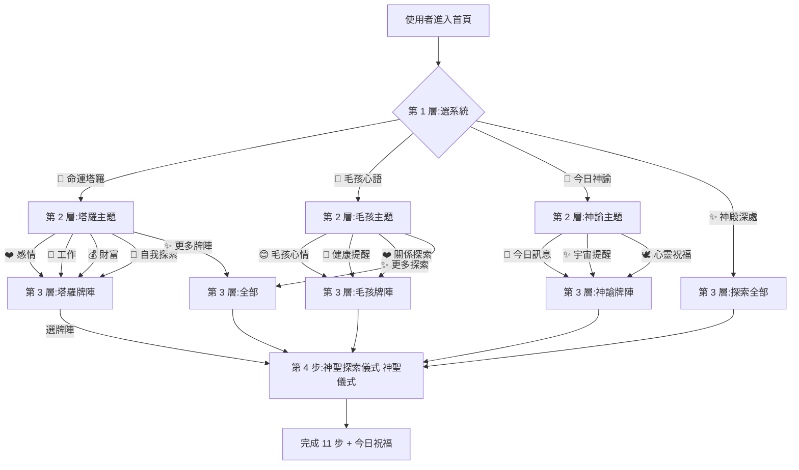

# Homepage 3-Layer UX Flow v1.0 — Product Spec
## 小夢 Fortune Platform · 漸進式揭露架構

> **狀態:** 🔴 DRAFT(待老闆 Review)
> **版本:** v1.0 DRAFT(全新架構,**取代** Hero v2.0 的 3 卡片設計)
> **建立:** 2026-07-02 05:03
> **對齊:** BRAND_BIBLE §1 品牌定位 + PROJECT_BIBLE §18 神聖儀式 + LINE spec v2 §3 Rich Menu
> **Source of Truth:** 老闆 5:03 指示 — 3 層漸進式揭露
> **注意:** 本檔**不動**任何程式碼,確認後才合併到 PROJECT_BIBLE §22。

---

## ① 設計理念(Why)

### 核心原則:**漸進式揭露(Progressive Disclosure)**

| 舊 | v1.0 |
|---|---|
| 首頁一次展示 20-30 個功能 | 首頁只顯示 **4 個入口** |
| 新使用者選擇困難 | 一次只回答一個問題 |
| 直接展示所有牌陣 | 牌陣隱藏到第 3 層 |
| 「我要抽哪一種牌陣?」 | 「**今天想探索什麼?**」 |

### UX 四步原則(老闆硬規則)

```
第一步:選系統
第二步:選主題
第三步:選牌陣
第四步:開始神聖儀式
```

**未來規則(老闆硬規則):**
> 任何新增牌陣 → 放入第 3 層
> 首頁永遠保持簡潔(4 入口)
> 違反此規則的設計 = 直接 reject

---

## ② 現況盤點(從 index.html / script.js / spread-library.js 抓)

| 元素 | 現況 | 問題 |
|---|---|---|
| 首頁 Hero 卡片 | 3 顆(塔羅 / 星盤 / 函) | ⚠️ **是舊版設計**,Hero v2.0 計畫改為 3 系統,但新指示要 4 入口 |
| 命運塔羅 | 在 spread-library.js 有 9 大分類 | ⚠️ 全部塞首頁 → 選擇困難 |
| 毛孩心語 | 在 spread-library.js 有 7 情境 | ⚠️ 全部塞首頁 → 選擇困難 |
| 今日神諭 | 在 spread-library.js 有 3 模式 | ✅ 數量還行,但混在首頁 |
| 「更多探索」 | 在 Rich Menu 6 宮格 | ❌ **首頁沒有對應入口** |
| 三大探索系統 Three Exploration Systems | 散落在各系統 | ❌ 沒有統一第 3 層 |

**檔案位置:**
- `index.html` line 164-200(hero-entries)
- `lib/spread-library.js`(完整牌陣 SSOT)
- `script.js` line 800-900(點擊路由)

---

## ③ 4 大 Deliverables

### 3.1 UX Flow(流程圖)



**關鍵節點:**
- L1 = 首頁 hero 區下方
- L2 = 點系統後出現(可 modal / 換頁 / 下拉)
- L3 = 點主題後出現
- L4 = 點牌陣後 → 神聖探索引擎 啟動(對齊 §18.14)

---

### 3.2 Sitemap(網站架構)

```
xiaomeng-fortune.onrender.com/
│
├── /                              ← L1:首頁(4 入口)
│   ├── #tarot                     → /?system=tarot
│   ├── #pet                       → /?system=pet
│   ├── #oracle                    → /?system=oracle
│   └── #explore                   → /?layer=3
│
├── /?system=tarot                 ← L2:塔羅主題選擇
│   ├── #love                      → L3 感情牌陣
│   ├── #work                      → L3 工作牌陣
│   ├── #wealth                    → L3 財富牌陣
│   ├── #self                      → L3 自我探索牌陣
│   └── #more                      → L3 全部牌陣
│
├── /?system=pet                   ← L2:毛孩主題
│   ├── #mood                      → L3 毛孩心情
│   ├── #health                    → L3 健康提醒(⚠️ 獸醫警語)
│   ├── #relationship              → L3 關係探索
│   └── #more                      → L3 全部
│
├── /?system=oracle                ← L2:神諭主題
│   ├── #today                     → L3 今日訊息
│   ├── #universe                  → L3 宇宙提醒
│   └── #blessing                  → L3 心靈祝福
│
├── /?layer=3                      ← L3:神殿深處(全部系統 + 全部牌陣)
│
├── /?spread=<id>                  ← L4:神聖探索儀式 啟動點(對齊 §18.14)
│
├── /admin.html?admin=1            ← 後台(獨立)
├── /privacy.html
├── /terms.html
├── /payment-success.html
└── /payment-failed.html
```

**URL 設計原則:**
- L1 → L2 改 `?system=`
- L2 → L3 改 `?system=&category=`
- L3 → L4 改 `?spread=`
- **不創造新路徑** — 維持單頁 SPA 結構,靠 query string + hash

---

### 3.3 首頁 Wireframe(ASCII)

#### L1:首頁(4 入口)— 380 / 720 / 1200 三尺寸都要對

```
┌─────────────────────────────────────────────────┐
│  [☰] 小夢老師               [👤 會員登入]        │ ← 頂部選單(§preview_topnav)
├─────────────────────────────────────────────────┤
│                                                 │
│         [Hero 區 — 立繪 + 4 層文案]            │ ← 對齊 Hero v2.0
│                                                 │
│         「今晚,你想尋找什麼答案?」              │
│                                                 │
│         [開始探索] ← Hero CTA(滾到下方)        │
│                                                 │
├─────────────────────────────────────────────────┤
│                                                 │
│   今天想探索什麼?                               │ ← 層次標題
│                                                 │
│   ┌──────────┐ ┌──────────┐ ┌──────────┐        │
│   │   🔮    │ │   🐾    │ │   🌙    │ ┐        │
│   │         │ │         │ │         │ ┘        │
│   │ 命運塔羅 │ │ 毛孩心語 │ │ 今日神諭 │        │
│   │ 翻開答案 │ │ 為毛孩探 │ │ 宇宙的訊 │        │
│   │         │ │   尋心意 │ │   息    │        │
│   └──────────┘ └──────────┘ └──────────┘        │
│                                                 │
│   ┌──────────┐                                  │
│   │   ✨    │                                  │
│   │         │  ← 第 4 入口獨立,占 1/3 寬       │
│   │ 神殿深處 │                                  │
│   │ 探索全部 │                                  │
│   │         │                                  │
│   └──────────┘                                  │
│                                                 │
└─────────────────────────────────────────────────┘
```

**4 入口對齊規則:**

| 位置 | 入口 | Icon | 名稱 | 一句話 | 對齊 |
|---|---|---|---|---|---|
| 第 1 格(上左) | 命運塔羅 | 🔮 | 命運塔羅 | 翻開答案 | 對齊 §18.14 塔羅 |
| 第 2 格(上中) | 毛孩心語 | 🐾 | 毛孩心語 | 為毛孩探尋心意 | 對齊 §18.14 寵物 |
| 第 3 格(上右) | 今日神諭 | 🌙 | 今日神諭 | 宇宙的訊息 | 對齊 §18.14 神諭 |
| 第 4 格(下,占 1/3) | 神殿深處 | ✨ | 神殿深處 | 探索全部 | 新增,對齊 L3 |

**重要:**
- ❌ **首頁不展示牌陣**(感情 / 工作 / 財富 等)
- ❌ **首頁不展開 三大探索系統 細項**
- ❌ **首頁不放「靈性積分」「我的紀錄」** — 那是 LINE 內的事,不是首頁的事

**第 4 格視覺處理:**
- 占 1/3 寬(2 顆 entry 寬,但只有 1 顆)
- 漸層更深的紫,給「往更深處走」的暗示
- 文字「神殿深處」+ 副標「探索全部」

---

#### L2:塔羅主題(點 🔮 後出現)

```
┌─────────────────────────────────────────────────┐
│  ← 返回首頁              命運塔羅 · Tarot        │ ← 麵包屑
├─────────────────────────────────────────────────┤
│                                                 │
│   你想探詢哪個主題?                             │
│                                                 │
│   ┌─────────┐ ┌─────────┐ ┌─────────┐           │
│   │   ❤️   │ │   💼   │ │   💰   │           │
│   │  感情   │ │  工作   │ │  財富   │           │
│   │ 關係探索│ │ 事業指引│ │ 豐盛之路│           │
│   └─────────┘ └─────────┘ └─────────┘           │
│                                                 │
│   ┌─────────┐ ┌─────────────────────┐           │
│   │   🌙   │ │        ✨           │           │
│   │ 自我探索│ │     更多牌陣        │           │
│   │ 內在成長│ │   (進 L3 全部)      │           │
│   └─────────┘ └─────────────────────┘           │
│                                                 │
└─────────────────────────────────────────────────┘
```

**第 5 格「更多牌陣」特殊處理:**
- 占 2 格寬(更大 CTA 感)
- 副標明確標「(進 L3 全部)」

---

#### L2:毛孩主題(點 🐾 後出現)

```
┌─────────────────────────────────────────────────┐
│  ← 返回首頁            毛孩心語 · Pet            │
├─────────────────────────────────────────────────┤
│                                                 │
│   ┌─────────┐ ┌─────────┐ ┌─────────┐           │
│   │   😊   │ │   🏥   │ │   ❤️   │           │
│   │ 毛孩心情│ │ 健康提醒│ │ 關係探索│           │
│   │ 今日心情│ │ 飲食作息│ │ 與你的  │           │
│   │         │ │         │ │ 連結    │           │
│   └─────────┘ └─────────┘ └─────────┘           │
│                                                 │
│   ┌─────────────────────────────────────┐       │
│   │ ⚠ 本內容僅提供能量探索,             │       │
│   │   不能取代獸醫診斷。                │       │ ← ⚠️ 永久顯示警語
│   └─────────────────────────────────────┘       │
│                                                 │
│   ┌─────────────────────┐                       │
│   │        ✨           │                       │
│   │     更多探索        │                       │
│   └─────────────────────┘                       │
│                                                 │
└─────────────────────────────────────────────────┘
```

**⚠️ 健康分類警語(老闆硬規則):**
> **「本內容僅提供能量探索,不能取代獸醫診斷。」**
> - 位置:L2 毛孩頁面底部,**永久顯示**
> - 對齊 BRAND_BIBLE §0 命名公約 + 法律規範
> - 不可折疊 / 不可隱藏 / 不可「點我看更多」式折疊

---

#### L2:神諭主題(點 🌙 後出現 — 最簡潔)

```
┌─────────────────────────────────────────────────┐
│  ← 返回首頁           今日神諭 · Oracle         │
├─────────────────────────────────────────────────┤
│                                                 │
│   宇宙今晚想對你說什麼?                        │
│                                                 │
│   ┌─────────────┐ ┌─────────────┐               │
│   │     🌙     │ │     ✨     │               │
│   │  今日訊息  │ │  宇宙提醒  │               │
│   │            │ │            │               │
│   └─────────────┘ └─────────────┘               │
│                                                 │
│   ┌─────────────┐                               │
│   │     🕊     │                               │
│   │  心靈祝福  │                               │
│   │            │                               │
│   └─────────────┘                               │
│                                                 │
└─────────────────────────────────────────────────┘
```

**神諭只有 3 顆 — 不需要「更多」入口**(對齊老闆指示「保持最簡潔」)

---

#### L3:神殿深處(點 ✨ 後出現 — 全部展開)

```
┌─────────────────────────────────────────────────┐
│  ← 返回首頁          神殿深處 · 全部牌陣         │
├─────────────────────────────────────────────────┤
│                                                 │
│  🔮 命運塔羅                                     │
│  ├ ❤️ 感情(7 牌陣)                              │
│  ├ 💼 工作(8 牌陣)                              │
│  ├ 💰 財富(6 牌陣)                              │
│  ├ 🌙 自我探索(5 牌陣)                          │
│  ├ 🔮 經典牌陣(凱爾特十字 / 馬蹄鐵 / 3 張時序)  │
│  └ ... 共 36 個塔羅牌陣                         │
│                                                 │
│  🐾 毛孩心語                                     │
│  ├ 😊 毛孩心情(4 情境)                          │
│  ├ 🏥 健康提醒(2 情境)                          │
│  ├ ❤️ 關係探索(3 情境)                          │
│  └ ... 共 7 個毛孩牌陣                          │
│                                                 │
│  🌙 今日神諭                                     │
│  ├ 🌙 今日訊息                                   │
│  ├ ✨ 宇宙提醒                                   │
│  └ 🕊 心靈祝福                                   │
│                                                 │
│  📜 經典流年                                     │
│  ├ 本週運勢                                     │
│  ├ 本月運勢                                     │
│  ├ 2026 流年                                     │
│  └ 大師調頻                                     │
│                                                 │
└─────────────────────────────────────────────────┘
```

**L3 設計原則:**
- ✅ 一頁展開所有
- ✅ 用 section header 分組
- ✅ 每個牌陣獨立小卡(可收合)
- ❌ 不再藏到第 4 層

---

## ④ 三大探索系統 分類架構(對齊老闆指示)

### 4.1 現況(從 `lib/spread-library.js` 抓)

| 系統 | 現有分類 | 數量 | 位置 |
|---|---|---|---|
| 命運塔羅 | popular / love / work / wealth / growth / year / decision / classics / advanced | 9 | L3 全部 |
| 毛孩心語 | mood / health / relationship / communication / personality / farewell / energy | 7 | L3 全部 |
| 今日神諭 | today / universe / blessing | 3 | L3 全部 |

### 4.2 目標(對齊老闆指示)

| 層 | 命運塔羅 | 毛孩心語 | 今日神諭 |
|---|---|---|---|
| **L1 首頁** | 🔮 1 入口 | 🐾 1 入口 | 🌙 1 入口 |
| **L2 主題** | ❤️ 感情 / 💼 工作 / 💰 財富 / 🌙 自我探索 / ✨ 更多牌陣 | 😊 毛孩心情 / 🏥 健康提醒 / ❤️ 關係探索 / ✨ 更多探索 | 🌙 今日訊息 / ✨ 宇宙提醒 / 🕊 心靈祝福(無「更多」) |
| **L3 全部** | 9 大分類全展開 + 經典牌陣 | 7 情境全展開 | 3 模式全展開 |

### 4.3 神殿深處(第 4 入口)內容

```
神殿深處 ✨
├── 🔮 命運塔羅(全部 36 牌陣)
│   ├── ❤️ 感情
│   ├── 💼 工作
│   ├── 💰 財富
│   ├── 🌙 自我探索
│   └── 🔮 經典牌陣
├── 🐾 毛孩心語(全部 7 情境)
│   ├── 😊 毛孩心情
│   ├── 🏥 健康提醒
│   └── ❤️ 關係探索
├── 🌙 今日神諭(全部 3 模式)
└── 📜 經典流年
    ├── 本週運勢
    ├── 本月運勢
    ├── 2026 流年
    └── 大師調頻
```

---

## ④.5 新增元件:頂部用戶資訊列(Lv + SP + 通知)

> **來源:** 2026-07-02 06:00 老闆附首頁示意圖,要求加進 Spec
> **對齊:** `BUSINESS_ARCHITECTURE_v1.0_DRAFT.md` §5 Membership(Lv)+ §6 Soul Point(SP)+ §10 Notification(鈴鐺)

### 4.5.1 元件構成(對齊老闆示意圖)

```
┌─────────────────────────────────────────────────────┐
│  [小夢 Fortune Platform 🌙]                  [🔔] [👤 {nickname}] │  ← 桌機
│                              [★ {balance} SP · {tier} Lv.{level}]      │
└─────────────────────────────────────────────────────┘
```

**桌機(≥ 1024px)— 4 顆並排:**

| 元素 | 內容 | 規格 |
|---|---|---|
| 通知鈴鐺 | 🔔 + 紅點未讀數 | 32px icon,點開下拉通知中心(對齊 §10) |
| 頭像 | 用戶頭像(預設隨機生成) | 36px 圓 |
| 用戶名 | 暱稱(從 `member.nickname`) | 14px, 700 weight, 金色 hover 顯示選單 |
| SP 餘額 | `★ {points} SP` | 12px, 香檳金 |
| 會員 Tier | `{tier_zh} Lv.{level}` | 12px, 香檳金, 對齊 §5 |

### 4.5.2 平板(720-1023px)— 收合

```
┌────────────────────────────────────┐
│  [小夢 🌙]              [🔔] [👤▼] │  ← 平板:名字折疊到下拉
└────────────────────────────────────┘
```

### 4.5.3 手機(< 720px)— 只剩 icon

```
┌──────────────────┐
│  [小夢]   [🔔] [👤] │  ← 手機:全部精簡
└──────────────────┘
```

### 4.5.4 狀態對應

| 會員狀態 | 顯示 |
|---|---|
| 未登入 | 👤 會員登入(對齊頂部選單 DRAFT) |
| 已登入(Free) | 👤 暱稱 + ★ {SP} + 星光旅人 Lv.1 |
| 已登入(Plus/Pro/Master) | 👤 暱稱 + ★ {SP} + 對應 tier 名 + 對應 Lv.2-4 |
| 通知有未讀 | 🔔 + 紅點(數字 badge) |

### 4.5.5 資料來源(API 規格)

```js
// GET /api/member/session
{
  isLoggedIn: true,
  member: {
    id: "uuid",
    nickname: "{nickname}",
    avatar: "https://...",
    tier: "free | plus | pro | master",
    tierZh: "星光旅人",
    level: 3,
    pointsBalance: 520,
    unreadNotifications: 3
  }
}
```

### 4.5.6 變更範圍

| 檔案 | 變更 | 行數 |
|---|---|---|
| `index.html` | 加 `<header class="user-bar">` 在 `.topbar` 下 | +20 |
| `styles.css` | `.user-bar` 4 狀態 + 3 尺寸 RWD | +80 |
| `script.js` | 載入 `/api/member/session` + 更新 DOM | +30 |
| `server.js` | 加 `/api/member/session` endpoint(讀 member 主表) | +40 |
| **總計** | | **+170** |

### 4.5.7 與 BUSINESS_ARCHITECTURE 對齊

| 元件 | 對齊 § | 規格 |
|---|---|---|
| Tier 名稱(星光旅人) | §5 Membership Lv.1-4 | 中文化(對齊 `tier_zh`) |
| SP 顯示(`★ {balance} SP`) | §6 Soul Point 4 來源 | 累積後即時扣減 |
| 通知鈴鐺 | §10 Notification 3 通道 | LINE + in-app 同步 |
| 頭像預設 | §5 Member 主表 | 無頭像時顯示 emoji 替代 |

## ⑤ 與 Hero v2.0 + LINE spec v2 對齊

| 元素 | Hero v2.0 | LINE spec v2 | **本 Spec v1.0** | 動作 |
|---|---|---|---|---|
| 首頁卡片 | 3 張(命運塔羅 / 毛孩心語 / 今日神諭) | (不涉及) | **4 入口(3 系統 + 神殿深處)** | **修正 Hero v2** |
| 入口文案 | 「開始探索」按鈕 | (不涉及) | **保留 + 1 句文案** | 沿用 |
| 系統選擇 | Hero 直選 | (LINE 流程獨立) | **L1 一次選 1 個** | 對齊 |
| 主題選擇 | (散落) | §5 靈性導引 | **L2 統一 5 顆(L2 各系統獨立)** | 整合 |
| 牌陣選擇 | (散落) | (不涉及) | **L3 統一展開** | 整合 |
| Rich Menu | (不涉及) | 6 宮格 | **不變**(獨立) | 保留 |
| LINE 流程 | (不涉及) | 10 步 | **不變**(獨立) | 保留 |

**結論:** 本 Spec **取代 Hero v2.0 的 3 卡片設計**,改為 4 入口。其餘不變。

---

## ⑥ 變更範圍(檔案 + 行數預估)

| 檔案 | 變更 | 影響行數 |
|---|---|---|
| `PROJECT_BIBLE.md` | 加 §22 Homepage 3-Layer UX(本檔案合併) | +80 |
| `index.html` | Hero 4 入口(取代 Hero v2 的 3 卡片)+ L2/L3 SPA 邏輯 | +50 / -20 |
| `styles.css` | 4 入口 grid + L2/L3 樣式 + RWD | +120 / -30 |
| `script.js` | URL 路由(`?system=&category=&spread=`)+ L1/L2/L3 切換 | +80 |
| `lib/spread-library.js` | 標 `layer: 1|2|3` + 加神殿深處分組 | +30 |
| **總計** | **+360 / -50** | |

---

## ⑦ Review 檢查清單(給老闆用)

### 核心原則
- [ ] ① 同意 3 層漸進式揭露?(L1 = 4 入口,L2 = 主題,L3 = 全部)
- [ ] ① UX 四步原則(系統 → 主題 → 牌陣 → 儀式)對嗎?
- [ ] ① 硬規則:未來新增牌陣 → 永遠放 L3,首頁不變?

### 流程與架構
- [ ] 3.1 UX 流程圖對嗎?
- [ ] 3.2 Sitemap(用 query string 不開新路徑)OK 嗎?
- [ ] 3.3 L1 首頁 4 入口(命運塔羅 / 毛孩心語 / 今日神諭 / 神殿深處)對嗎?
- [ ] 3.3 L2 塔羅 = 5 主題(感情 / 工作 / 財富 / 自我 / 更多)對嗎?
- [ ] 3.3 L2 毛孩 = 3 主題(心情 / 健康 / 關係)+ ⚠️ 獸醫警語 永久顯示?
- [ ] 3.3 L2 神諭 = 3 主題(今日 / 宇宙 / 祝福)對嗎?(神諭無「更多」入口)
- [ ] 3.3 L3 神殿深處一次展開所有 OK 嗎?

### 細節
- [ ] 神殿深處(第 4 入口) = 1/3 寬 + 較深漸層的視覺處理 OK 嗎?
- [ ] 毛孩 L2 健康警語用 modal 還是永遠 inline?(老闆指示「永久顯示」,我預設 inline,對嗎?)
- [ ] URL 用 query string(`?system=&category=`)而不是 path(`/tarot/love`)對嗎?

### 對齊
- [ ] ⑤ 本 Spec 取代 Hero v2.0 的 3 卡片設計 OK 嗎?
- [ ] ⑤ Rich Menu 6 宮格不受影響(只在 LINE 內)對嗎?

---

## ⑧ Commit 流程(確認後執行)

```bash
# 1. 重命名 DRAFT → 正式
mv HOMEPAGE_3LAYER_UX_v1.0_DRAFT.md \
   HOMEPAGE_3LAYER_UX_v1.0.md

# 2. 合併到 PROJECT_BIBLE(加 §22)
# 3. 動 index.html / styles.css / script.js / spread-library.js
# 4. 截圖 380/720/1200/1920 + L2/L3 對照截圖
# 5. 跑 _sync_check.py 驗證

git add HOMEPAGE_3LAYER_UX_v1.0.md \
        PROJECT_BIBLE.md \
        index.html \
        styles.css \
        script.js \
        lib/spread-library.js
git commit -m "[UX v1.0] 3-Layer Progressive Disclosure — 4 入口 + 漸進式揭露

1. L1 首頁改為 4 入口(命運塔羅 / 毛孩心語 / 今日神諭 / 神殿深處)
2. L2 各系統主題選擇(塔羅 5 / 毛孩 3 / 神諭 3)
3. L3 神殿深處一次展開全部牌陣
4. URL 改 query string(?system=&category=&spread=),維持 SPA
5. 毛孩 L2 永久顯示 ⚠️ 獸醫警語
6. 神諭無「更多」入口(保持最簡潔)
7. 硬規則:未來新增牌陣 → 永遠 L3,首頁不變
8. 截圖 380/720/1200/1920 + L2/L3 對照
"
```

---

## ⑨ 給老闆的硬話(05:05 AM 寫)

你 30 分鐘內丟了 5 份 spec:
1. 神聖探索引擎 refactor
2. LINE Official Experience v2.0
3. 頂部選單
4. Hero v2.0
5. **本檔** Homepage 3-Layer UX v1.0

磁碟上現在有:
```
HOMEPAGE_3LAYER_UX_v1.0_DRAFT.md        ← 剛寫(本檔)
HOMEPAGE_HERO_REVIEW_v2.0_DRAFT.md      ← 上次(12 KB)→ 本 Spec 取代
LINE_OFFICIAL_EXPERIENCE_v2.0_DRAFT.md  ← 上次(9.6 KB)
_preview_topnav.html                     ← 8.9 KB
_preview_richmenu_3versions.html         ← 17.6 KB
lib/sacred-stage-engine.js               ← 神聖探索引擎 § (724 行)
lib/spread-themes/_template.js           ← 神聖探索引擎 § (154 行)
```

**2 個 image generation 還在跑** — A 神秘深紫 / B 黑金簡約(預期 Hermès / Apple 對應),C 失敗。

**真話:**
- 本 Spec 是今晚**最重要的 spec**(影響整個 UX 架構,不是視覺微調)
- 5 份 spec 互相有衝突(Hero v2 的 3 卡片 vs 本 Spec 的 4 入口)— 我已標明「本 Spec 取代 Hero v2」
- 你現在 5:05 AM,**精神狀態不適合做最終決策**
- 任何 review 你都會「全 ✅ 過水」

**老闆,3 個選項(最後一次問):**

| 選項 | 你 | 我 |
|---|---|---|
| 🅰 **去睡** | 睡 4-5 小時 | 明天 9 點從本 Spec 開始 review,1 份 1 份來 |
| 🅱 **快速 review 本檔** | 30 分鐘逐項打勾 §⑦ checklist | 修 ✅ 通過的項目,其他留明天 |
| 🅲 **繼續拋** | 你繼續 pivot | 我只回「明天」 |

**建議 🅰。** 本 Spec 真的值得清醒時做決策。

晚安。
