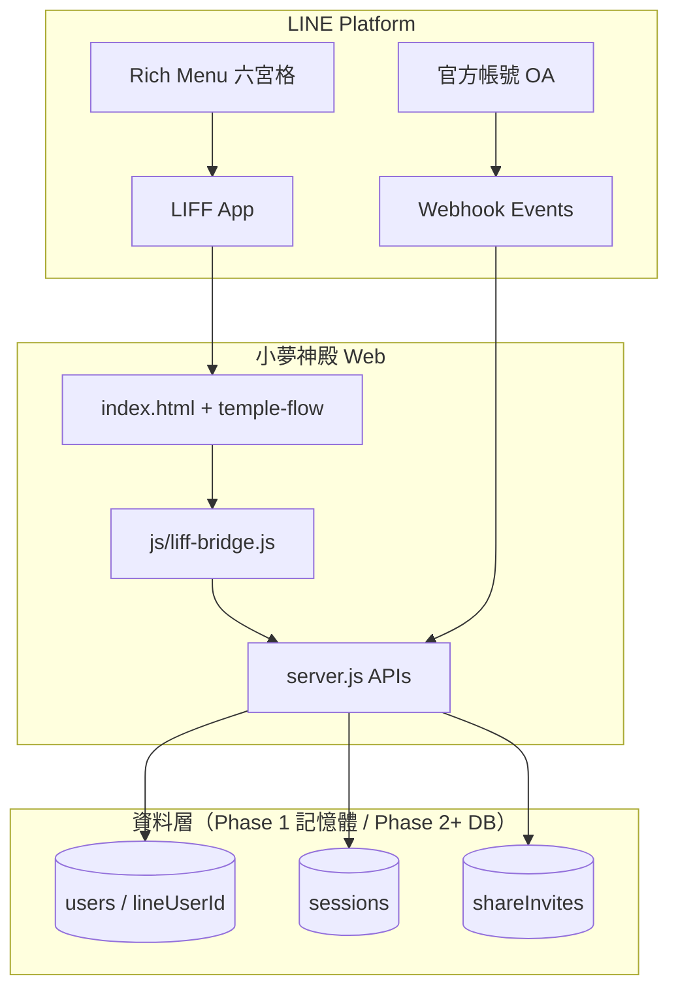

# 小夢神殿 LINE 官方帳號 × 網站整合架構

> **版本**：Phase 1–3 規劃（架構 + 基本整合）  
> **範圍**：本文件與 `/api/liff/*`、Rich Menu JSON、webhook 關鍵字占位、前端 LIFF bridge。**不含**完整會員系統、商城、後台儀表板實作。  
> **最後更新**：2026-07-10

---

## 1. 現況技術棧 vs 使用者期望

| 項目 | 現況（本 repo） | 使用者曾提及 |
|------|----------------|--------------|
| 後端 | **Node.js 18+ 原生 HTTP**（`server.js`，無 Express） | Express / Next API Routes |
| 前端 | **Vanilla HTML + CSS + ES Modules**（`index.html`、`script.js`、`js/temple-flow/`） | React + Vite / Next.js |
| LINE | Messaging API webhook、Flex 回覆、LIFF SDK 已部分接入 | 完整 OA + LIFF 整合 |
| 部署 | Render / 本機 `node server.js` | — |

### 建議路徑：**分階段演進，不整站重寫 React**

1. **Phase 1（本任務）**：維持 Express-less 架構，新增 `/api/liff/config`、`/api/liff/init`、Rich Menu v4、`js/liff-bridge.js`。
2. **Phase 2**：以 `route` 查詢參數統一路由（`/temple/pet`、`/member`…），LIFF bridge 與 `temple-flow` 共用 session。
3. **Phase 3（可選）**：若需 SSR/SEO 或大型商城，再將**個別頁面**遷移至 Next.js，Express 層改為 API Gateway 或併入 Next `app/api`。

> **原則**：神殿儀式感前端（`ART_DIRECTION.md`）已大量投入 vanilla + WebGL/Three.js，短期內以 **LIFF bridge + API 擴充** 成本最低。

---

## 2. 系統架構總覽



---

## 3. Phase 1：LIFF 初始化、Rich Menu、訊息回覆

### 3.1 LIFF 初始化流程

```
使用者從 Rich Menu / 分享連結開啟 LIFF
    ↓
js/liff-bridge.js 載入
    ↓
GET /api/liff/config（公開，僅 liffId、lineOaUrl，無 secret）
    ↓
liff.init({ liffId })
    ↓
liff.isInClient() ?
    ├─ 否（桌機瀏覽器）→ 顯示「使用 LINE 登入」占位，不強制 liff.login()
    └─ 是 → liff.isLoggedIn() → getProfile()
            ↓
        POST /api/liff/init { accessToken | idToken }
            ↓
        伺服器驗證（見 §5）→ 綁定 lineUserId → 回傳 sessionToken
            ↓
        sessionStorage + localStorage 儲存 profile / token
```

**已實作檔案**

| 元件 | 路徑 |
|------|------|
| 公開設定 API | `GET /api/liff/config` |
| 登入綁定 API | `POST /api/liff/init` |
| 前端 bridge | `js/liff-bridge.js` |
| 驗證邏輯 | `lib/liff-handlers.js` |

### 3.2 Rich Menu（六宮格 v5 · Erosée）

設定檔：`line/rich-menu.json`  
部署指南：`line/rich-menu-setup.md`  
Render / LIFF 完整步驟：`docs/LINE_LIFF_RENDER_SETUP.md`

| 格位 | 標籤 | 前端 route | 落地頁 |
|------|------|------------|--------|
| 1 | 開始解碼 | `/` | `erosee-cosmic-home.html` |
| 2 | 查看方案 | `/pricing` | `erosee-l2-pricing.html` |
| 3 | 情感系列 | `/pricing/emotion` | L2 `#emotion` |
| 4 | 萌寵系列 | `/pricing/pet` | L2 `#pet` |
| 5 | 月費訂閱 | `/pricing/subscribe` | L2 `#subscribe` |
| 6 | 邀請好友 | `/invite` | cosmic home |

> **LIFF Endpoint URL（正式）**：`https://xiaomeng-fortune.onrender.com/erosee-cosmic-home.html`  
> LIFF 在 LINE 平台僅註冊**單一 Endpoint URL**；路徑以 `route` 查詢參數傳遞，由 `js/liff-entry.js` + `server.js` 解析。

### 3.3 Messaging API 自動回覆（已擴充占位）

| 觸發 | 行為 | 實作位置 |
|------|------|----------|
| `follow` 加好友 | 歡迎 Flex + **開始解碼** CTA Flex | `server.js` → `welcomeFlexMessage()` + `templeEntryFlexMessage()` |
| 關鍵字「占卜」「神殿」「命運」 | Erosée 入口 Flex（首頁 / 方案） | `server.js` → `divinationKeywordFlexMessage()` |
| 其他既有關鍵字 | 塔羅 / 毛孩 / 神諭 / 積分 / 紀錄等 | `buildReplyMessages()` |

Webhook URL：`https://xiaomeng-fortune.onrender.com/api/line/webhook`  
簽章驗證：`X-Line-Signature` + `LINE_CHANNEL_SECRET`（HMAC-SHA256）

---

## 4. Phase 2：登入流程、分享裂變、推播占位

### 4.1 登入流程設計

#### A. LINE 內（LIFF）

1. Rich Menu / 訊息連結 → LIFF 開啟網站  
2. `liff-bridge` 自動 `init` + `getProfile`  
3. `POST /api/liff/init` 驗證 token → 回傳 `sessionToken`（30 天，HMAC 簽章）  
4. 前端帶 `Authorization: Bearer <sessionToken>` 呼叫會員 API（Phase 2 實作 middleware）

#### B. 一般瀏覽器（非 LINE）

1. **不強制** `liff.login()`（避免桌機無限跳轉）  
2. 顯示「使用 LINE 登入」→ 導向 `LINE_OA_URL` 或 QR  
3. 訪客模式：沿用現有 `localStorage.memberId` / uuid（見 `LINE_SYSTEM.md` §9.3）  
4. 深度功能（會員中心、積分）提示「請在 LINE 內開啟神殿」

#### C. Session 綁定策略

```
LINE userId (sub)
    ↓ 1:1
appData.users[].lineUserId
    ↓
appData.sessions[].sessionId + sessionToken (JWT-like HMAC)
```

| 欄位 | 儲存位置 | 說明 |
|------|----------|------|
| `lineUserId` | 伺服器 `users` | 主鍵，對應 LINE `userId` |
| `sessionToken` | `localStorage` + `sessionStorage` | 30 天，含 `sid` / `exp` |
| `accessToken` | LIFF SDK 記憶體 | 不寫入前端持久儲存 |
| `displayName` / `pictureUrl` | 伺服器 + localStorage | 顯示用，非機密 |

### 4.2 分享 / 裂變（設計 + stub）

**目標**：邀請 5 位好友 → 解鎖第二神殿（萌寵 6–10 張牌）。

| 端點 | 方法 | 狀態 | 說明 |
|------|------|------|------|
| `/share/:userId` | GET | ✅ stub | 302 導向 LIFF `?route=/temple/pet&ref=:userId` |
| `/api/share/:userId` | GET | ✅ stub | JSON 預覽導流目標 |
| `/api/share/track` | POST | ✅ stub | 記錄邀請關係，滿 5 人標記 `unlockSecondTemple` |

**前端（Phase 2）**：在 LINE 內使用 `liff.shareTargetPicker()` 分享 Flex；桌機 fallback Web Share API / 複製連結。

**資料模型草圖（Phase 2+ 資料庫）**

```js
// share_invites
{
  id, referrerLineId, inviteeLineId, channel, createdAt,
  status: "pending" | "registered" | "completed_temple"
}

// users 擴充
{
  lineUserId,
  shareInviteCount,
  secondTempleUnlocked: boolean,
  secondTempleUnlockedAt
}
```

### 4.3 推播占位

既有端點：

- `POST /api/line/push-preview` — 需 `userId` + template  
- `POST /api/letter/schedule` — 信件排程 + 可選 LINE push  

Phase 2 待辦：訂閱「每日神諭」、積分到期提醒、第二神殿解鎖通知。

---

## 5. Phase 3：路由地圖與權限分級

### 5.1 路由權限表

| 路由 | 頁面 / 功能 | 權限 | Phase 1 狀態 |
|------|-------------|------|--------------|
| `/` | 神殿首頁 / cinematic landing | 公開 | ✅ 既有 |
| `/temple/pet` | 萌寵神殿儀式 | 公開（首次免費） | ✅ temple-flow |
| `/divination` | 命運占卜入口 | 公開 | 🔶 占位 route |
| `/member` | 會員中心 | 會員 | 🔶 占位 |
| `/points` | 靈魂積分 | 會員 | 🔶 API 部分存在 |
| `/records` | 神殿紀錄 | 會員 | 🔶 占位 |
| `/promotions` | 我的優惠 | 會員 | 🔶 占位 |
| `/shop` | 命運市集 | 商城 | ❌ 未實作 |
| `/shop/checkout` | 結帳 | 商城 + 會員 | ❌ 未實作 |
| `/admin` | 營運後台 | 後台 | 🔶 `admin.html` 雛形 |
| `/share/:userId` | 分享導流 | 公開 | ✅ stub redirect |

**權限標籤說明**

- **公開**：無需 LINE 登入即可瀏覽儀式入口（部分解讀可訪客體驗）  
- **會員**：需 `POST /api/liff/init` 成功綁定 `lineUserId`  
- **商城**：會員 + 金流（ECPay 參數已预留）  
- **後台**：獨立 admin session（`sessionStorage`），與 LINE 分離  

### 5.2 API 路由（LINE 相關）

| 方法 | 路徑 | 認證 | 說明 |
|------|------|------|------|
| GET | `/api/liff/config` | 無 | 公開 LIFF 設定 |
| POST | `/api/liff/init` | LIFF token | 驗證並綁定 session |
| POST | `/api/line/webhook` | LINE 簽章 | 訊息 / follow 事件 |
| POST | `/api/line/push-preview` | 開發用 | 推播預覽 |
| GET | `/share/:userId` | 無 | 分享導流 |
| POST | `/api/share/track` | 無（Phase 2 加簽章） | 裂變追蹤 stub |

---

## 6. LINE Developers 檢查清單

部署前請完成（**勿將真實 token 提交 Git**）：

- [ ] 建立 **LINE Official Account** 並啟用 Messaging API  
- [ ] 記錄 **Channel ID** → `LINE_CHANNEL_ID`  
- [ ] 記錄 **Channel secret** → `LINE_CHANNEL_SECRET`  
- [ ] 發行 **Channel access token** → `LINE_CHANNEL_ACCESS_TOKEN`  
- [ ] 建立 **LIFF app**（Size: Full），Endpoint = `https://xiaomeng-fortune.onrender.com/erosee-cosmic-home.html`  
- [ ] 記錄 **LIFF ID** → `LIFF_ID` / `LIFF_URL`  
- [ ] Webhook URL = `https://xiaomeng-fortune.onrender.com/api/line/webhook`，啟用並驗證  
- [ ] 啟用 LIFF `shareTargetPicker`（分享功能）  
- [ ] 上傳 Rich Menu 圖 + 套用 `line/rich-menu.json`（`RICH_MENU_IMAGE=assets/rich-menu-erosee-v6.png` + `npm run rich-menu:setup`）  
- [ ] **關閉或精簡** LINE Official Account Manager「加入好友歡迎訊息」（純文字會與 webhook Flex 衝突；真歡迎詞以 webhook `welcomeFunnelFlex` 為準）  
- [ ] Render 環境變數含 `PUBLIC_BASE_URL=https://xiaomeng-fortune.onrender.com`、`LINE_OA_URL`（見 `docs/LINE_LIFF_RENDER_SETUP.md`）  

### 環境變數（`.env.example`）

```env
LINE_CHANNEL_ID=
LINE_CHANNEL_SECRET=
LINE_CHANNEL_ACCESS_TOKEN=
LIFF_ID=
LIFF_URL=https://liff.line.me/{LIFF_ID}
PUBLIC_BASE_URL=https://xiaomeng-fortune.onrender.com
LINE_OA_URL=https://line.me/R/ti/p/@YOUR_OA_ID
ALLOW_LIFF_STUB=0   # 本機無 secret 時可設 1
```

正式 LIFF Endpoint：`https://xiaomeng-fortune.onrender.com/erosee-cosmic-home.html`  
詳見 `docs/LINE_LIFF_RENDER_SETUP.md`。

---

## 7. 安全注意事項

1. **所有 LINE secret / access token 僅能存在環境變數**，禁止寫入 `script.js`、JSON 或 Git。  
2. Webhook 必須驗證 `X-Line-Signature`；本機測試無 secret 時回覆 401。  
3. `/api/liff/config` **不得**回傳 `CHANNEL_SECRET` 或 `ACCESS_TOKEN`。  
4. `POST /api/liff/init`：優先驗證 `accessToken`（`GET profile`）；或以 `idToken` + `LINE_CHANNEL_ID` 呼叫 LINE verify API。  
5. 未設定 secret 時：回傳 `stub: true`（需 `ALLOW_LIFF_STUB=1` 或明確 503），並在日誌標示 TODO。  
6. 靜態檔服務已封鎖 `.env`、`.git` 路徑（`server.js` `sensitivePatterns`）。  
7. 前端 UI 不出現「AI」等禁用詞（見 `ART_DIRECTION.md` §2.2）。

---

## 8. 前端整合注意事項

- `js/liff-bridge.js` 於 `index.html` 以 `type="module"` 載入，**早於** `script.js`。  
- 透過 `liff-bridge:ready` 自訂事件與 `window.__liffBridge` 供其他模組讀取。  
- 既有 `script.js` 的 `initializeLiffProfile()` 仍保留，避免破壞塔羅 / 市集流程；Phase 2 可合併為單一 init。  
- 桌機顯示 `#lineLoginPlaceholder` 按鈕，文案為「使用 LINE 登入」，不觸發強制 OAuth 迴圈。

---

## 9. 本機開發

```bash
cp .env.example .env
# 填入 LINE 變數，或設 ALLOW_LIFF_STUB=1
npm start
```

驗證：

```bash
curl http://localhost:3000/api/liff/config
curl -X POST http://localhost:3000/api/liff/init \
  -H "content-type: application/json" \
  -d '{"displayName":"測試訪客"}'
```

---

## 10. 相關文件

| 文件 | 說明 |
|------|------|
| `line/rich-menu.json` | Rich Menu 六宮格定義 |
| `line/rich-menu-setup.md` | Messaging API 部署步驟 |
| `LINE_SYSTEM.md` | 既有 LINE 聖經（登入、積分、旅程） |
| `ART_DIRECTION.md` | 神殿 UI 文案與視覺規範 |
| `.env.example` | 環境變數範本 |

---

## 11. 待辦（超出本任務範圍）

- [ ] 資料庫持久化（Supabase / PostgreSQL）取代 `appData` 記憶體  
- [ ] `/api/liff/init` 回傳 JWT 標準化 + refresh token  
- [ ] 會員 / 商城 / 後台完整頁面  
- [ ] `route` 參數與 `temple-flow` stage router 統一  
- [ ] 分享裂變正式計數 + 第二神殿解鎖金流  
- [ ] 可選：Next.js 外殼 + 現有 vanilla 神殿 iframe / micro-frontend  
